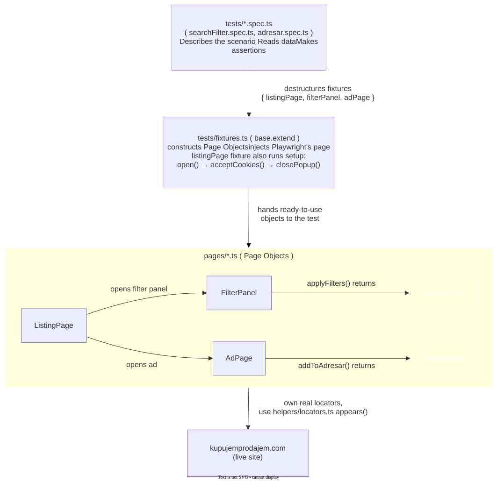
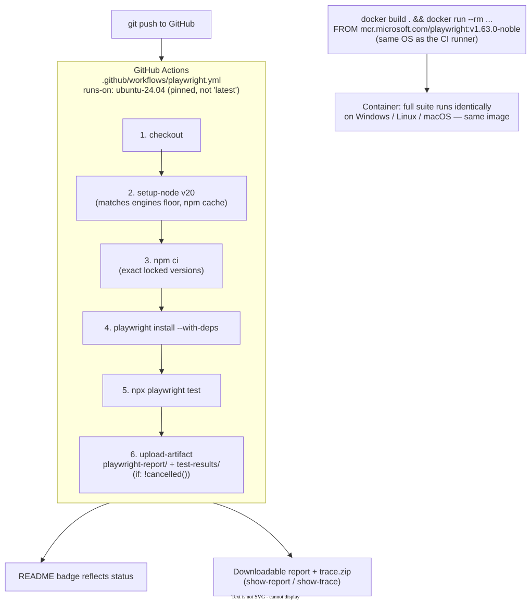

## Test architecture

The spec files read data and make assertions, but never touch a locator directly. Everything below them is layered: fixtures construct and set up the Page Objects, the Page Objects hold all real interaction logic, and `applyFilters()` / `addToAdresar()` return the _next_ page object rather than the test having to know what comes next.

## CI / Docker pipeline

CI and Docker are two independent paths to the same guarantee: CI proves the suite passes on every push, on a pinned Ubuntu runner; Docker proves the exact same environment can be spun up and run identically anywhere, on demand, not just inside GitHub's runners.
